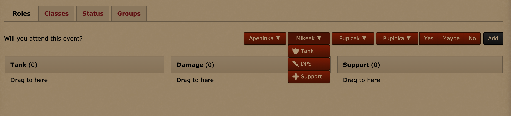

# Shivtr Extension: Quick Sign Up

This Tampermonkey userscript implements functionality to easily signup for events on the Shivtr platform.

## Installation

1. Make sure you have user scripts enabled in your browser (these instructions refer to the latest versions of the browser):

   - Firefox - install [Tampermonkey](https://tampermonkey.net/?ext=dhdg&browser=firefox) or [Greasemonkey](https://addons.mozilla.org/en-US/firefox/addon/greasemonkey/).
   - Chrome - install [Tampermonkey](https://tampermonkey.net/?ext=dhdg&browser=chrome).
   - Opera - install [Tampermonkey](https://tampermonkey.net/?ext=dhdg&browser=opera) or [Violent Monkey](https://addons.opera.com/en/extensions/details/violent-monkey/).
   - Safari - install [Tampermonkey](https://tampermonkey.net/?ext=dhdg&browser=safari).
   - Dolphin - install [Tampermonkey](https://tampermonkey.net/?ext=dhdg&browser=dolphin).
   - UC Browser - install [Tampermonkey](https://tampermonkey.net/?ext=dhdg&browser=ucweb).

2. Click here for [installation of user script](https://github.com/kozubikmichal/tampermonkey-shivtr-quick-signup/raw/master/main.user.js).

3. Go to any Shivtr hosted website and navigate to event detail. Mention several new buttons depending on your characters setup.

## Features

- Adds button for quick signup with any of your characters directly from the event page.

